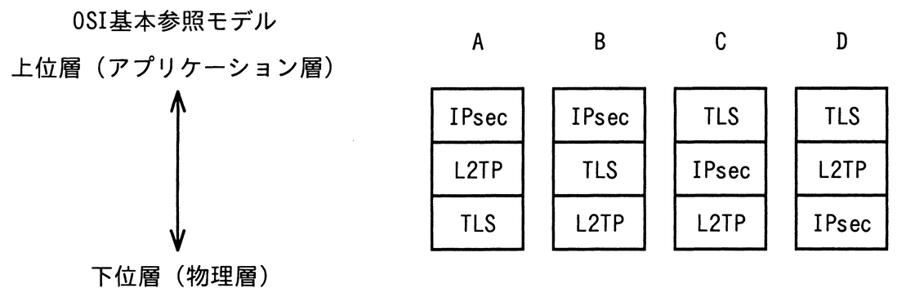

# 令和7年度春期 問43（技術要素）

## 問題文

VPNで使用されるプロトコルであるIPsec，L2TP，TLSの，OSI基本参照モデルにおける相対的な位置関係はどれか。

ア　A

イ　B

ウ　C

エ　D

## 使用画像

## 解答と解説

**正解：ウ**

OSI基本参照モデルにおける各プロトコルの位置づけは次のとおりである。
- TLS：トランスポート層（TCP）の上，アプリケーション層の下で動作し，上位層寄りに位置する。
- IPsec：ネットワーク層（IP層）で動作する。
- L2TP：データリンク層のトンネリングプロトコルであり，下位層寄りに位置する。

したがって，上位層側から順に「TLS→IPsec→L2TP」と並ぶ図が正しい配置となる。選択肢の図Cがこの並び（TLS，IPsec，L2TPの順）に一致する。

- 図A・図B：IPsecがTLSより上位に描かれており誤り。
- 図D：L2TPがIPsecより上位に描かれており誤り。

**IPA公式：ウ**

