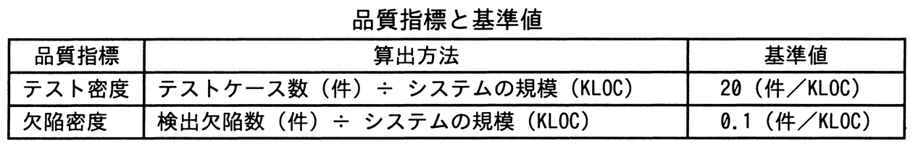
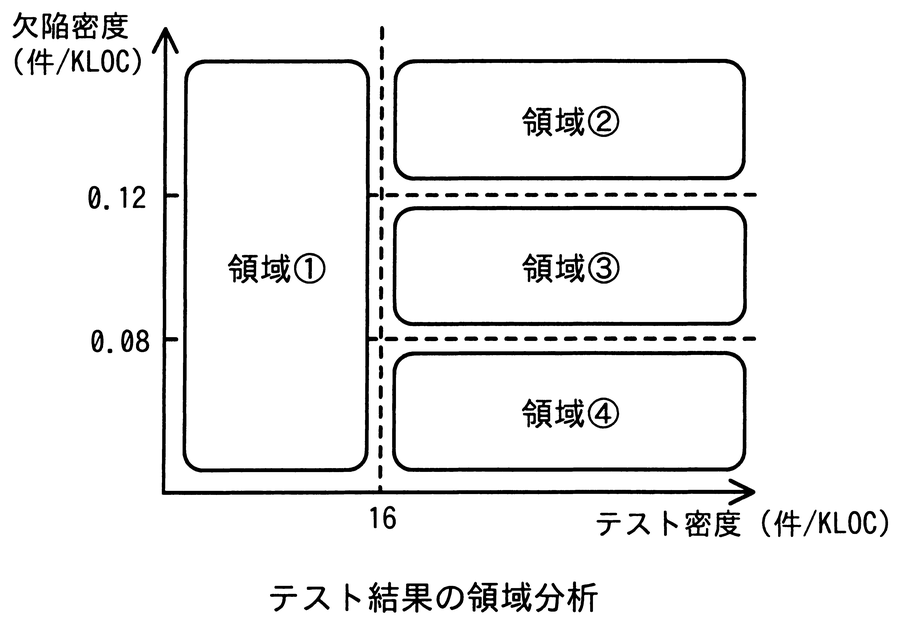

# 令和7年度春期 問54（マネジメント）

## 問題文

あるシステム開発プロジェクトのシステムテストにおけるテスト密度及び欠陥密度の値は，図に示した領域①～領域④のうち，領域④の範囲内であった。品質管理基準に照らして評価すると，行うべき活動として最も適切なものはどれか。ここで，このプロジェクトの品質管理基準では，定量評価の基準として，表に従ってテスト密度及び欠陥密度の基準値を設定した上で，テスト密度は基準値の80％以上であること，かつ，欠陥密度は基準値の80％以上120％未満であることと定めている。

ア　欠陥密度は基準を満たしているが，システムの品質に問題がないか，欠陥の妥当性を確認する。

イ　システムの欠陥が多いので，検出した欠陥の原因を分析した上で，システムの品質改善に取り組む。

ウ　システムの欠陥を十分に検出できていない懸念があるので，テストの観点に漏れがないかなど，テストケースの妥当性を確認する。

エ　テスト密度が不足しているので，システムの規模に見合うテストケース数以上となるように，テストケースを追加する。

## 使用画像

