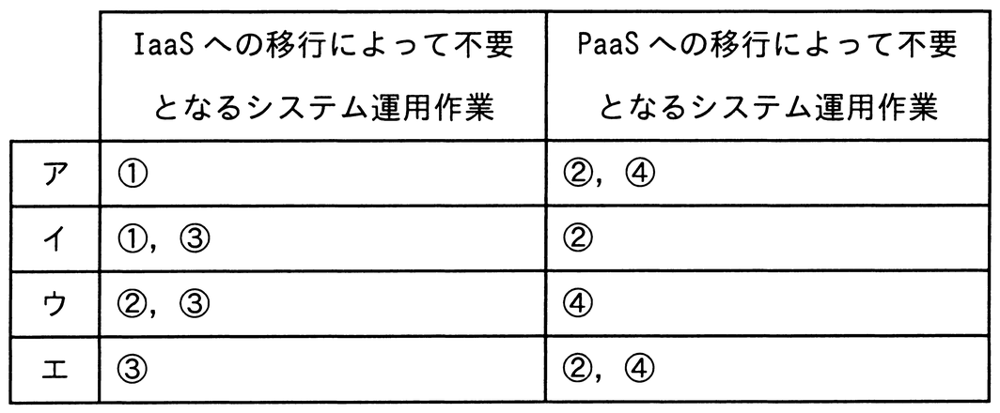

# 令和7年度春期 問56（ストラテジ）

## 問題文

A社は，自社がオンプレミスで運用している業務システムを，クラウドサービスへ段階的に移行する。段階的移行では，初めにネットワークとサーバをIaaSに移行し，次に全てのミドルウェアをPaaSに移行する。A社が行っているシステム運用作業のうち，この移行によって不要となるシステム運用作業の組合せはどれか。

〔A社が行っているシステム運用作業〕

　① 業務システムのバッチ処理のジョブ監視

　② 物理サーバの起動，停止のオペレーション

　③ ハードウェアの異常を警告する保守ランプの目視監視

　④ ミドルウェアへのパッチ適用

## 使用画像

## 解答と解説

**正解：ウ**

IaaS（Infrastructure as a Service）は，ネットワークやサーバなど物理インフラをクラウド事業者が提供・管理するサービス形態である。ネットワークとサーバをIaaSに移行すると，物理サーバそのものをA社が保有しなくなるため，「②物理サーバの起動，停止のオペレーション」および「③ハードウェアの異常を警告する保守ランプの目視監視」といった物理ハードウェアに関する運用作業が不要となる。

次に，ミドルウェアをPaaS（Platform as a Service）に移行すると，OSやミドルウェアの運用・管理もクラウド事業者側の責任範囲になるため，「④ミドルウェアへのパッチ適用」が不要になる。

一方，「①業務システムのバッチ処理のジョブ監視」は，インフラ層・ミドルウェア層のいずれの移行によっても，アプリケーション（業務システム）側の運用作業として引き続きA社が実施する必要があり，不要にはならない。

以上より，IaaSへの移行で不要になる作業は②・③，PaaSへの移行で不要になる作業は④の組合せであるウが正解。

**IPA公式：ウ**

