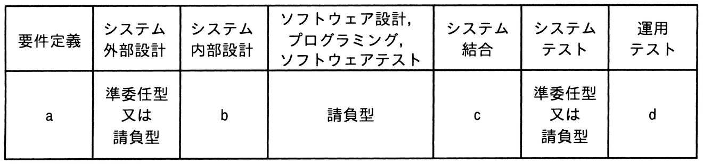

# 令和7年度春期 問66（ストラテジ）

## 問題文

ベンダーX社に対して，表に示すように要件定義フェーズから運用テストフェーズまでを委託したい。X社との契約に当たって，“情報システム・モデル取引・契約書＜第二版＞”に照らし，各フェーズの契約形態を整理した。a〜dの契約形態のうち，準委任型が適切であるとされるものはどれか。

ア　a，b

イ　a，d

ウ　b，c

エ　b，d

## 使用画像

## 解答と解説

**正解：イ**

“情報システム・モデル取引・契約書＜第二版＞”では、成果物の完成が明確に定義しやすい工程（システム内部設計、ソフトウェア設計・プログラミング・ソフトウェアテスト、システム結合）は「請負型」が、発注者と受注者が共同で作業を進め、明確な完成責任を問いにくい上流・下流工程（要件定義、システム外部設計の一部、システムテスト、運用テスト）は「準委任型」が適切とされる。

表より、システム外部設計（a）とシステムテスト（d相当の欄）は「準委任型又は請負型」と示されており選択制である。一方、要件定義（a）は発注者と協働して要件を固める工程のため準委任型が適切、運用テスト（d）も本番相当環境での検証作業であり準委任型が適切とされる。したがって準委任型が適切なのはaとdであり、イが正解。

bはシステム内部設計であり、外部仕様に基づき内部構造を確定させ成果物（設計書）を完成させる工程のため請負型が適切。cはシステム結合であり、結合したシステムの動作結果という成果物を検証する工程のため請負型が適切。よってb・cは準委任型ではない。

**IPA公式：イ**
