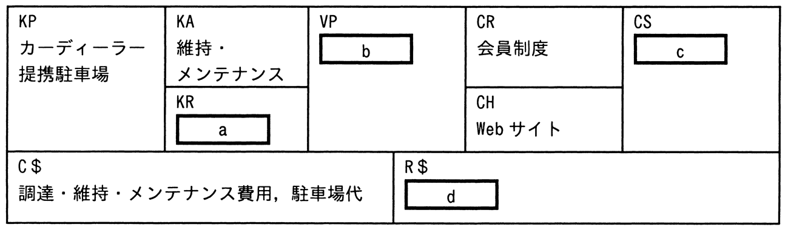

# 令和7年度春期 問69（ストラテジ）

## 問題文

カーシェアビジネスをビジネスモデルキャンバスに当てはめた。bに該当するものはどれか。なお，ア〜エはa〜dのいずれかに該当する。

〔カーシェアビジネス〕

　・カーディーラーから車両を調達し，維持・メンテナンスしながら，その車両を提携駐車場に保管・準備する。

　・必要なときだけ車両を使いたい人が登録する会員制度を構築し，会員から月会費を徴収する。

　・会員向けのWebサイトで，会員に使いたい車両や利用時間などを予約してもらい，会員に対して車両の時間貸しを行い，利用料を徴収する。

〔ビジネスモデルキャンバス〕

ア　月会費，利用料

イ　車両

ウ　車両の時間貸し

エ　必要なときだけ車両を使いたい人

## 使用画像

## 解答と解説

**正解：ウ**

ビジネスモデルキャンバスは、KP（主要パートナー）、KA（主要活動）、KR（主要リソース）、VP（価値提案）、CR（顧客との関係）、CH（チャネル）、CS（顧客セグメント）、C$（コスト構造）、R$（収益の流れ）の9要素で構成される。画像の欄はそれぞれ a=KR、b=VP、c=CS、d=R$ に対応している。

画像のbはVP（価値提案）の欄にあたる。VPは「顧客に提供する価値（何を提供するか）」を表す要素であり、カーシェアビジネスの説明文における「会員に対して車両の時間貸しを行い，利用料を徴収する」という記述から、顧客に提供している価値は「車両の時間貸し」である。したがってbには「ウ　車両の時間貸し」が該当する。

他の選択肢は次のように対応する。
- ア「月会費，利用料」→ R$（収益の流れ）＝d（会員から得る収入）
- イ「車両」→ KR（主要リソース）＝a（事業を行うために保有・調達するリソースそのもの）
- エ「必要なときだけ車両を使いたい人」→ CS（顧客セグメント）＝c（サービスを提供する対象顧客）

VP（b）は「車両」というリソース自体ではなく、それを「時間貸しする」という提供形態・価値そのものを指す点が、イとウを区別するポイントである。

**IPA公式：ウ**
