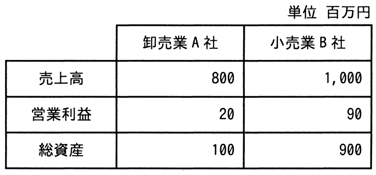

# 令和7年度春期 問76（ストラテジ）

## 問題文

表から，卸売業A社と小売業B社の財務指標を比較したとき，卸売業A社について適切な記述はどれか。

ア　売上高，総資産の額がともに低く，総資産回転率も低い。

イ　売上高営業利益率が高く，総資産営業利益率も高い。

ウ　営業利益，総資産の額がともに低く，総資産営業利益率も低い。

エ　総資産回転率が高く，総資産営業利益率も高い。

## 使用画像

## 解答と解説

**正解：エ**

総資産回転率＝売上高 ÷ 総資産、総資産営業利益率（ROA相当）＝営業利益 ÷ 総資産で計算する。

卸売業A社：総資産回転率＝800 ÷ 100＝8.0（回）、総資産営業利益率＝20 ÷ 100＝20％
小売業B社：総資産回転率＝1,000 ÷ 900≒1.11（回）、総資産営業利益率＝90 ÷ 900＝10％

A社はB社に比べて総資産回転率・総資産営業利益率のいずれも高い。卸売業は一般に総資産（在庫等）に対する売上高の比率が高く、資産を効率的に回転させて利益を上げる傾向がある点とも整合する。したがって「総資産回転率が高く，総資産営業利益率も高い」と述べたエが正解。

アは売上高・総資産の額の大小のみに言及しており指標の比較として不適切。イは売上高営業利益率（20/800=2.5%）がB社（90/1000=9%）より低いため誤り。ウは総資産営業利益率が低いとする点が誤り（実際はA社の方が高い）。

**IPA公式：エ**
